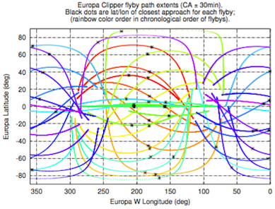

ganse_clipper_traj  
Andrew Ganse, APL-UW, aganse@apl.washington.edu  
http://staff.washington.edu/aganse  
3 Dec 2014  

--------------------------------------------------------------------------------
Fortran/Matlab/Octave implementation to read publicly available SPICE files for
proposed Europa Clipper trajectories.

--------------------------------------------------------------------------------

                                    last tested with:  
                                    gfortran 4.9.2, Matlab R2011b, Octave 3.8.0  
                                    JPL SPICE Toolkit version N0065  
                                    on OSX Yosemite 10.10.1  

These codes extract Europa Clipper proposed spacecraft trajectories from public
NASA SPICE database files and saves their Europan lat/long/altitude values into
binary data files (one for each of the 45 flybys), which are then easily loaded
into Matlab or Octave.  The included Matlab/Octave scripts read and plot that
extracted data as a verification and demonstration for use in further coding.

The Fortran source uses the NASA NAIF spice toolkit, available at:
http://naif.jpl.nasa.gov/naif/toolkit.html  (last access 1 Dec 2014),
implemented into my code with generous assistance from Chuck Acton, NASA NAIF.
It also uses the publicly available proposed Europa Clipper trajectory data
available at:
https://solarsystem.nasa.gov/europa/iceedocs.cfm  (last access 1 Dec 2014).
The files on that page are the contents of the SPICE_ephem subdirectory here;
included here to show where they go and which files are needed.
(FIXME: Further distribution of this package in future may require me to
separate those files out from this package...)
The Matlab/Octave code here also relies on publicly available SimplePeakFind.m
function, included here for convenience; its author's website is listed in
that script.  (FIXME: same issue with SimplePeakFind.m as for SPICE files in
future distributions of this package.)

To compile the Fortran code:  
1. Ensure you have GNU gfortran installed (latest test used gfortran ver 4.9.2)  
2. You must download/install the JPL SPICE Toolkit library:
 (download from:  http://naif.jpl.nasa.gov/naif/toolkit_FORTRAN.html)
 Took perhaps 5-10min to compile on my 2011 MacBook Pro.  
3. Edit the Makefile for this ganse_clipper_traj package to change the path of
 the JPL Toolkit to wherever you installed it.  
4. While in the ganse_clipper_traj directory, enter "make".  This will compile
 clipper_trajorbs_calc.f but not clipper_trajall_calc.f (because I don't use
 that one much anymore since getting the times of closest approach out of it).
 For that one enter "make clipper_trajall_calc".

Quick descriptions of files in this package:  
  `Makefile` - make sure to personalize your path to JPL SPICE Toolkit in here
  `README.txt` - this file
  SPICE_ephem/ - contains the Europa Clipper ephem and related SPICE files
  SimplePeakFind.m - used by clipper_trajorbs_read.m for finding times of
                              closest approach (times of altitude minima)
  clipper_traj_data/ - the directory to which clipper_trajall_calc and
       clipper_trajorbs_calc write their data files (empty till they run)
  clipper_trajall_calc.f - Fortran code that extracts COMPLETE (large!)
        dataset of all points in several years of proposed Europa Clipper
     trajectories.  Myself I only used this data to find closest approach
         points for use in clipper_trajorbs_calc.f and haven't used since.
  clipper_trajall_plot.pdf - result from clipper_trajall_read.m showing 
           the 45 closest approach times used in clipper_trajorbs_calc.f.
  clipper_trajall_read.m - Matlab code that reads output of
        clipper_trajall_calc.f that was written to clipper_traj_data dir.
  clipper_trajorbs_calc.f - Fortran code that extracts +/-30min of
    trajectory around the closest approach points of the 45 flyby orbits.
  clipper_trajorbs_plot.pdf - result from clipper_trajorbs_read.m showing
        the lat/lon projections of those closest-approach segments of the
                 flybys, with the closest approach points marked as well.
  clipper_trajorbs_read.m - Matlab code that reads output of
       clipper_trajorbs_calc.f that was written to clipper_traj_data dir.

Note the source files clipper_trajorbs_calc.f and clipper_trajall_calc.f are
almost identical, with just a few differences to extract the full trajectory
vs just the trajectory segments around the closest approach points.  The
amount of those segments on either side of the closest approach points can
be changed within clipper_trajorbs_calc.f.

Note the plotting bits in the *.m files here require Octave version >= 3.8.0.
The plotting parts appear to run a lot slower in Octave than in Matlab but
they do generally work here.  (Although appears Octave's datetick xaxis is
repeating year every six months... hm.)  I saved Octave versions of the plots
for comparison, adding "octave" to their filenames to distinguish them.

Anyway, I think that covers it.  For any questions/concerns/comments please
feel free to contact Andy at aganse@apl.washington.edu

Cheers! -Andy
